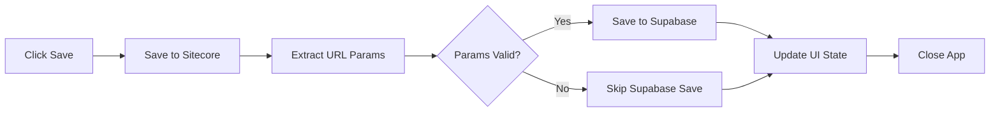

# 🎉 Database Connection Complete!

## ✅ What's Been Done

### 1. Supabase Client Installed
```bash
✅ @supabase/supabase-js package installed
```

### 2. Environment Variables Set Up
```bash
✅ .env.local file created with Supabase credentials
```

### 3. Code Updated
```bash
✅ src/app/page.tsx - Imports added
✅ src/app/page.tsx - handleSave function updated
✅ src/lib/supabase-client.ts - Helper functions ready
```

### 4. Database Schema
```bash
✅ image_metadata table created in Supabase
✅ Full-text search indexes created
✅ Helper functions deployed
```

## 🚀 Ready to Test!

### Step 1: Restart Your Dev Server

```bash
npm run dev
```

### Step 2: Test the Save Functionality

1. Open your application in the browser
2. Make sure your URL has the required parameters:
   - `?organizationId=org_xxxxx`
   - `&key=xxxxxx`
3. Upload an image or select an existing one
4. Add Alt Text and Description
5. Click **Save**

### Step 3: Check the Console

You should see these messages:
```
✅ Saved to Sitecore
Saving to Supabase with params: { organizationId: '...', key: '...' }
✅ Saved to Supabase with ID: <uuid>
```

### Step 4: Verify in Supabase

Go to your Supabase dashboard:
https://supabase.com/dashboard/project/uuerpqlqvisllxwevryb/editor

Select the `image_metadata` table to see your saved data!

## 📋 What Happens When You Click Save



1. **Saves to Sitecore** - Your existing field value is saved
2. **Extracts URL Parameters** - Gets `organizationId` and `key` from URL
3. **Saves to Supabase** - Stores metadata in the database with:
   - organization_id
   - key
   - image_item_path
   - image_item_id
   - image_preview_path
   - alt_text
   - description
4. **Updates UI** - Marks changes as saved
5. **Closes the app** - Returns to Sitecore

## 🔍 Data Being Saved

```typescript
{
  organization_id: "org_lxSEYVnF3YpVUlEQ",  // From URL
  key: "e3641953fabc471fb110d46241bce7a1",  // From URL
  image_item_path: "/sitecore/media library/...",  // From Sitecore
  image_item_id: "item-123",  // From Sitecore
  image_preview_path: "https://.../-/jssmedia/...",  // Generated
  alt_text: "Beach sunset",  // User input
  description: "Beautiful sunset..."  // User input
}
```

## 🛠️ Troubleshooting

### Issue: "Skipping Supabase save - missing URL params"

**Solution**: Make sure your URL includes both `organizationId` and `key` parameters:
```
http://localhost:3000/?key=xxx&organizationId=org_xxx
```

### Issue: "Failed to save to Supabase"

**Solution**: 
1. Check that `.env.local` exists and has the correct values
2. Restart your dev server: `npm run dev`
3. Check browser console for detailed error messages

### Issue: Network error or CORS

**Solution**: 
1. Verify your Supabase URL is correct in `.env.local`
2. Check your Supabase project is active at https://supabase.com/dashboard

## 📊 View Your Data

### Option 1: Supabase Dashboard
1. Go to: https://supabase.com/dashboard/project/uuerpqlqvisllxwevryb/editor
2. Click on `image_metadata` table
3. See all your saved images

### Option 2: SQL Editor
```sql
SELECT * FROM image_metadata 
WHERE organization_id = 'your_org_id' 
AND key = 'your_key'
ORDER BY created_at DESC;
```

## 🔎 Test Search Functionality

You can test the search in the Supabase SQL Editor:

```sql
SELECT * FROM search_images_by_text(
    'org_lxSEYVnF3YpVUlEQ',
    'e3641953fabc471fb110d46241bce7a1',
    'sunset beach',
    10
);
```

## 📝 Next Steps

- [ ] Test saving images with metadata
- [ ] Verify data appears in Supabase
- [ ] Implement search functionality in the "Find" tab
- [ ] Add loading states for database operations
- [ ] Add error handling UI

## 🎯 Code Changes Made

### `src/app/page.tsx`

**Added imports:**
```typescript
import { upsertImageMetadata, getUrlParams } from '@/src/lib/supabase-client';
```

**Updated `handleSave` function:**
- Saves to Sitecore (existing)
- Extracts organizationId and key from URL
- Saves to Supabase database
- Logs success/failure messages

## 📚 Documentation

- `database/README.md` - Full database documentation
- `database/SETUP.md` - Detailed setup guide
- `database/IMPLEMENTATION_SUMMARY.md` - Implementation details
- `src/lib/supabase-client.ts` - TypeScript helper functions

## ✨ Features Now Available

✅ **Dual Save** - Data saved to both Sitecore and Supabase
✅ **Organization Isolation** - Each org can only see their own data
✅ **Full-Text Search Ready** - Description-based search available
✅ **Automatic Timestamps** - Created/updated times tracked
✅ **Type Safety** - Full TypeScript support
✅ **Error Handling** - Graceful failure with logging

## 🎊 You're All Set!

Just restart your dev server and start testing!

```bash
npm run dev
```

Happy coding! 🚀

